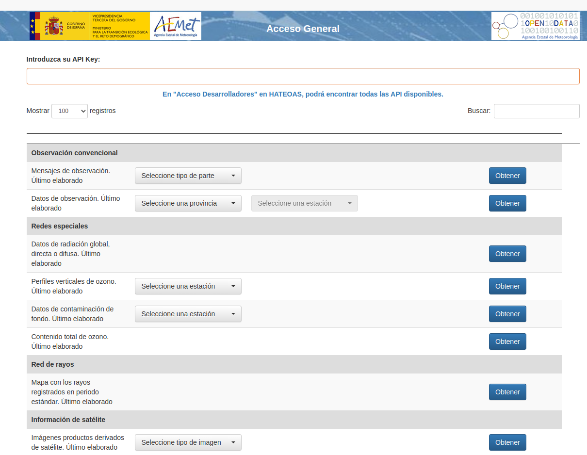
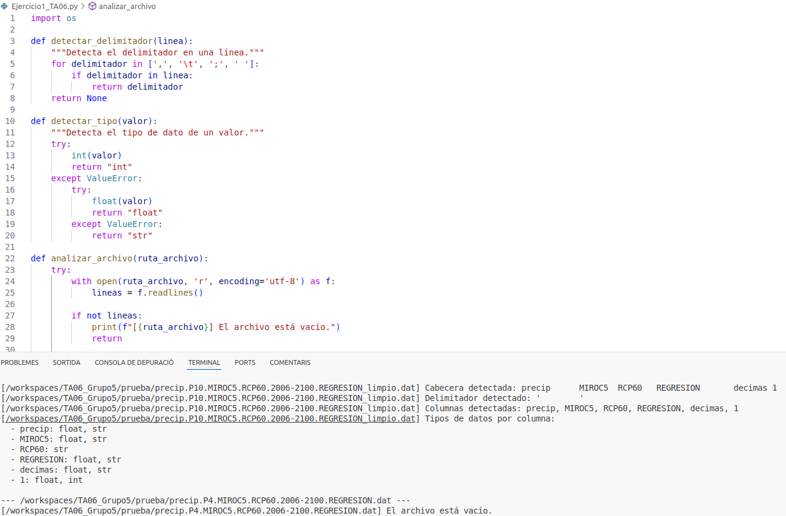
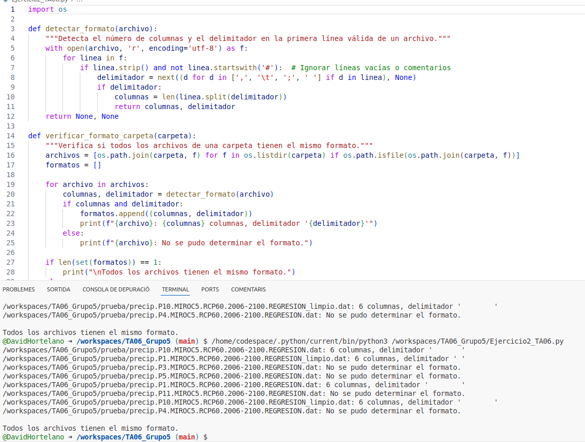
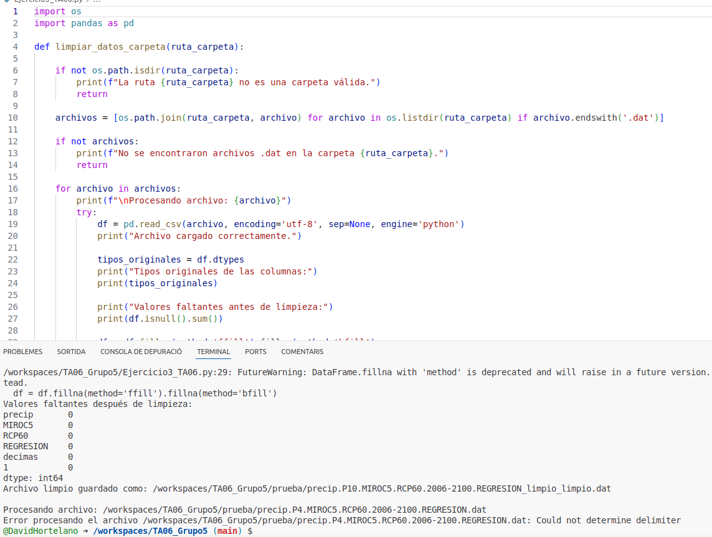
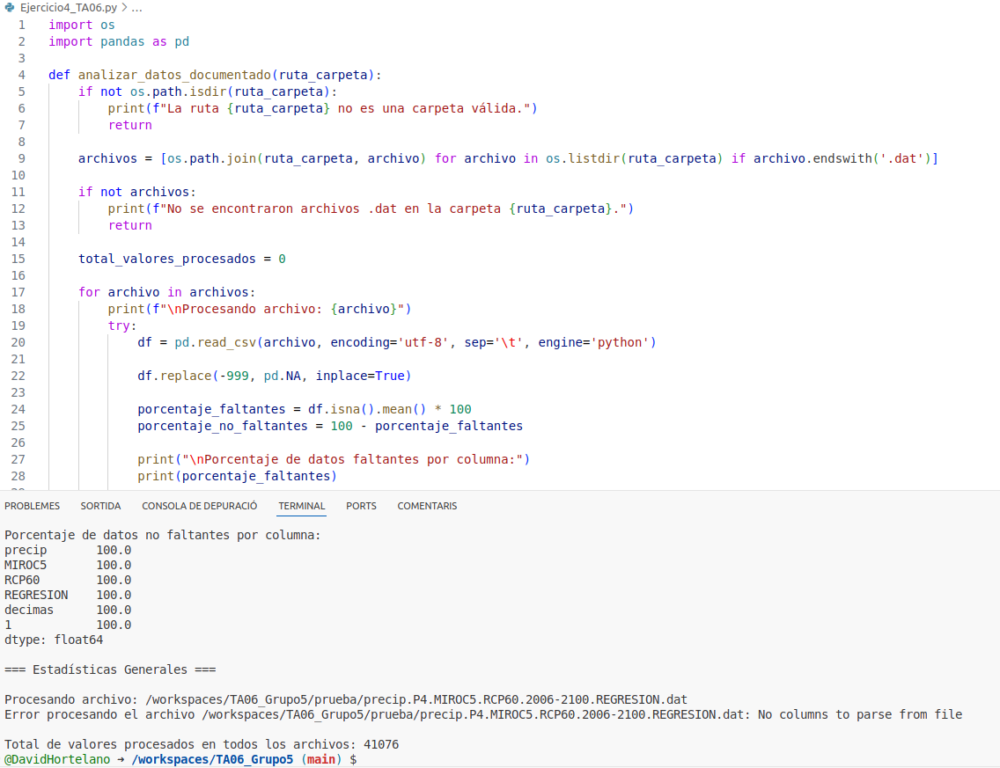

Bienvenido al manual del TA06_Grup5
---
## Indice1
1. [Obtencion de datos](#ejercicio-1)
2. [Organizar y procesar datos](#ejercicio-2)
3. [Reflexion](#ejercicio-5)

---
<!-- Ejercicio 1 -->
# Ejercicio 1
## Obtencion de datos
 - Para obtener los datos hemos investigado en una pagina  muy fiable de datos meteorologicos.
 [AEMET](https://opendata.aemet.es/centrodedescargas/productosAEMET)

 

---
<!-- Ejercicio 2 -->
# Ejercicio 2
## Organizar y procesar datos

**Paso 1:** Revisar las cabeceras, separación entre datos, comentarios… Saber cómo están delimitados los datos.
- Para hacer este paso hemos realizado un script el cual nos ayuda a revisar todos los archivos de manera eficiente.

**Paso 2:** Verificando que todos los archivos tienen el mismo formato.
- Como en el ejercicio uno la manera mas eficiente era crear un script.

**Paso 3:** Limpiar los datos: Asegurar que los datos no contengan errores, valores que falten o inconsistencias.
- Para hacerlo rapidamente y sin mucho trabajo tambien hemos hecho un script.

**Paso 4:** Calcular el porcentaje de datos carentes (-999). Calcular estadísticas: de los datos procesados. Medias y totales anuales: Muestra la precipitación total y media por año. Tendencia de cambio: La tasa de variación anual de las precipitaciones. Extremos: Los años más lluviosos y más secos. Analizar los datos: pensar qué estadísticas tiene sentido hacer. Y añadir por lo menos dos más.
- Por ultimo y para completar el ejercicio de manera simetrica hemos generado un script para ayudarnos.

---
<!-- Ejercicio 3 -->
# Ejercicio 3
## Reflexión

En esta parte de la práctica tenemos que explicar que hemos aprendido cada uno de los miembros del grupo.
En cada apartado, de manera individual, tenemos que indicar el nivel de aprendizaje sobre lo que hemos aprendido durante la practica en general.

# Registro de aprendizaje de 
---
## Qué es lo que he aprendido durante la práctica?
- : **Bien**

- : **Bien**

- : **Algo**

-: **Algo**

- : **Poco**

---
# Registro de aprendizaje de 
---
## Qué es lo que he aprendido durante la práctica?
- Trabajo en grupo: he aprendido a explicar mis ideas: **Bien**

- Trabajo en grupo: he aprendido a explicar mis ideas: **Bien**

- He entendido como subir los datos obtenidos al GitHub: **Algo**

- :He intentado entender como obtener los datos: **Algo**

- He aprendido como generar los diferentes resultados: **Poco**

---
# Registro de aprendizaje de 
---
## Qué es lo que he aprendido durante la práctica?
- : **Bien**

- : **Bien**

- : **Algo**

- : **Algo**

- : **Poco**

